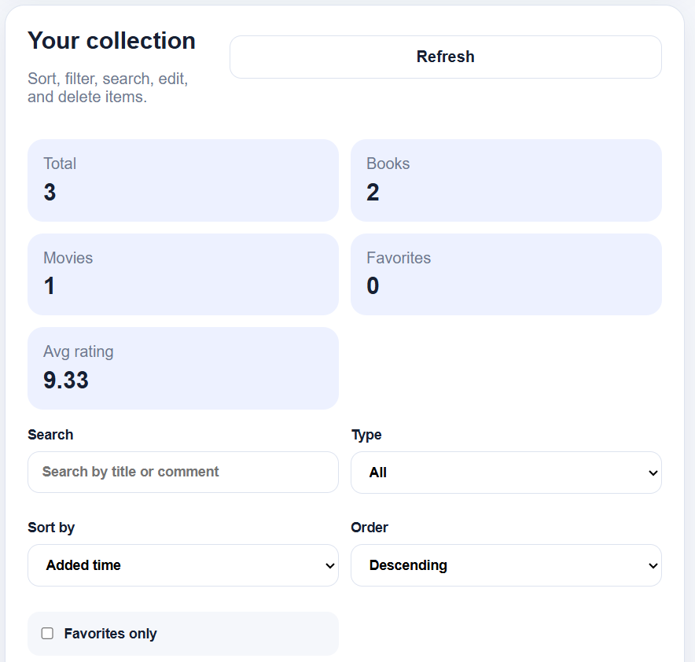
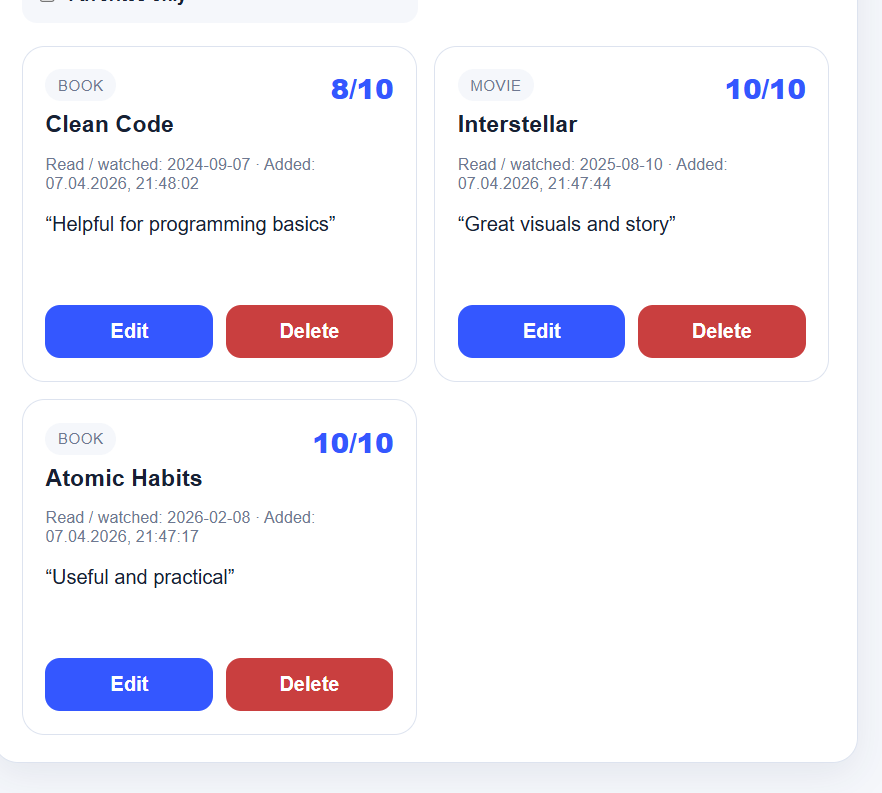

# Book Collection

A personal web app to track books and movies with ratings, comments, sorting, filtering, and favorites.

## Demo

Add screenshots here after you run the project:
- Main collection page
- Add item form
- Filtered/sorted collection view
- Edit item flow
- Statistics cards

## Demo screenshots

### Add item


### Collection overview


### Collection cards


## Product context

### End users
Any person who wants to keep a personal catalog of books and movies they have already read or watched.

### Problem that the product solves
People often forget what they watched or read, how much they liked it, and what they would recommend. Notes are usually scattered across different places, so it is inconvenient to keep a structured personal collection.

### Solution
Book Collection is a web app where users can save books and movies, rate them, leave comments, mark favorites, and browse the collection using sorting, filtering, and search.

## Features

### Implemented
- Add a new item
- Choose item type: book or movie
- Set title
- Set rating from 1 to 10
- Set read/watched date
- Add a personal comment
- Mark an item as favorite / recommended
- View all items in a collection
- Sort by added time, rating, title, or date
- Filter by item type
- Search by title or comment
- Edit existing items
- Delete items
- View collection statistics
- Backend API
- Database persistence with SQLite
- End-user-facing web client
- Dockerized application

### Not yet implemented
- User accounts
- Tags / genres
- Import/export collection
- Recommendation engine
- Mobile app client

## Version plan

### Version 1
Version 1 does one core thing well: storing books and movies in a personal collection.

Included in V1:
- Add item
- View collection
- Sort by rating, date, and title
- Persistent storage in database
- Simple working web interface

### Version 2
Version 2 builds on top of Version 1.

Added in V2:
- Filter by item type
- Search by title/comment
- Favorites
- Edit and delete
- Statistics cards
- Better UI polish
- Docker-based deployment

### TA feedback points addressed
Potential feedback addressed in Version 2:
- better browsing experience
- more convenient filtering and sorting
- clearer UI
- more complete CRUD functionality

## Usage

1. Open the web app in the browser.
2. Add a new book or movie.
3. Enter title, rating, date, and comment.
4. Save the item.
5. Browse the collection.
6. Sort items by rating, date, title, or added time.
7. Filter by type, search by title/comment, and mark favorites.
8. Edit or delete items when needed.

## Deployment

### OS
Ubuntu 24.04

### What should be installed on the VM
- Git
- Docker
- Docker Compose plugin

### Step-by-step deployment instructions

1. Clone the repository:
   ```bash
   git clone <your-repo-url>
   cd se-toolkit-hackathon
   ```

2. Build and start the app:
   ```bash
   docker compose up --build -d
   ```

3. Open the product:
   ```text
   http://<VM-IP>:8000
   ```

4. Stop the app:
   ```bash
   docker compose down
   ```

## API overview

### Health check
- `GET /health`

### Items
- `POST /api/items`
- `GET /api/items`
- `GET /api/items/{id}`
- `PUT /api/items/{id}`
- `DELETE /api/items/{id}`

### Stats
- `GET /api/stats`
